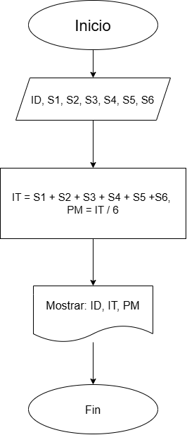
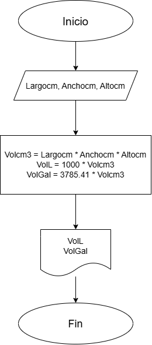
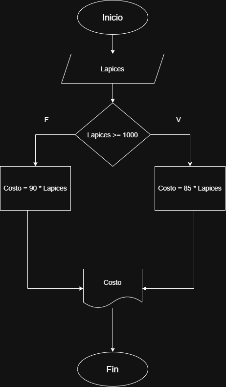
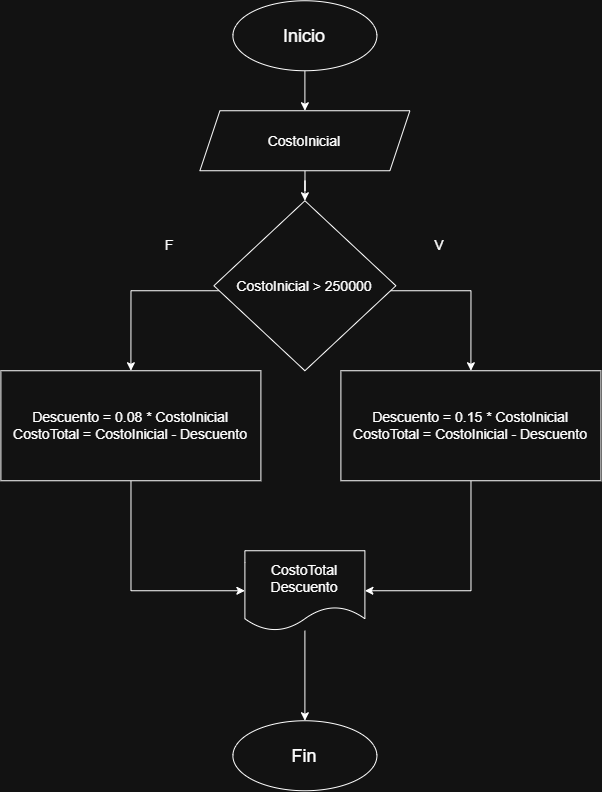
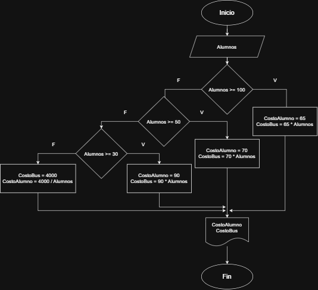
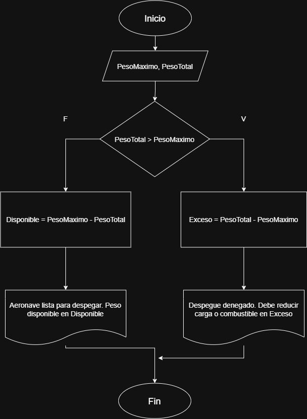
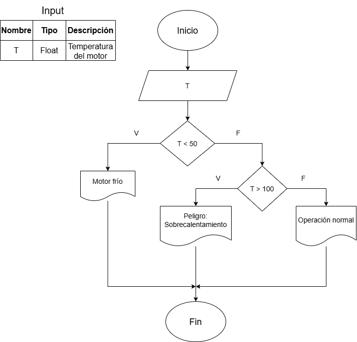

# Bitácora 2° unidad  
  
## Actividad 1: Representación de Datos en el Mundo Digital  
  
### Ejercicio 1:   
    
 **En la Figura 2 se muestran los diferentes estados que se pueden representar usando una palabra binaria de 3 bits. Responde la pregunta de la imagen: ¿Cuántos estados diferentes se pueden representar usando N bits?**   
Respuesta: 2^N  
  
### Ejercicio 2:  
 **Convierte el número decimal 22 a binario**  
Respuesta:  
    22 / 2 = 11, residuo 0  
    11 / 2 = 5, residuo 1  
    5 / 2 = 2, residuo 1  
    2 / 2 = 1, residuo 0  
    1 / 2 = 0, residuo 1  
    Residuos de abajo hacia arriba, por lo tanto: 22 = 10110  
  
### Ejercicio 3:  
  **¿Cuál es el resultado en decimal del número binario 10110?**  
Respuesta:  
    1 * (2^4) + 0 * (2^3) + 1 * (2^2) + 1 * (2^1) + 0 * (2^0) = 22  
  
### Ejercicio 4:  
  **¿Qué número binario representa el carácter 'C' en ASCII?**  
Respuesta:  
    01000011  
  
### Ejercicio 5:  
  **Convierte el número flotante 5.75 a binario (explica los pasos)**  
Respuesta:  
    Parte entera: 5  
    5 / 2 = 2, residuo 1  
    2 / 2 = 1, residuo 0  
    1 / 2 = 0, residuo 1  
    Residuos de abajo hacia arriba, por lo tanto: 5 = 101  
    Parte decimal: .75  
    0.75 x 2 = 1.5   ->   Se toma la parte entera 1  
    0.5 x 2 = 1   ->   Se tom la parte entera 1  
    Tomando las partes enteras de arriba hacia abajo: .75 = .11  
    Por lo tanto, 5.75 = 101.11  
  
### Ejercicio 6:  
  **¿Cuántos bytes se necesitan para almacenar la palabra “Hola” en ASCII?**  
Respuesta:  
    "Hola" tiene 4 letras y cada letra ocupa un byte, por lo que  
    4 * 1 = 4 bytes  
  
### Ejercicio 7:  
  **¿Cuántos bits hay en 5 KB?**  
Respuesta:  
    KB a Bytes:  
    5 * 1024 = 5120 Bytes  
    Bytes a Bits:  
    5120 * 8 = 40960 Bits  
  
### Ejercicio 8:  
  **Convierte el número decimal 255 a hexadecimal.**  
Respuesta:  
    255 / 16 = 15, residuo 15  
    Como 15 = F  
    255 = FF  
  
### Ejercicio 9:  
  **¿Cuál es el valor hexadecimal de la secuencia binaria 11010110?**  
Respuesta:  
    Agrupar en 4 bits: 1101 y 0110  
    1101: 8 + 4 + 0 + 1 = 13  ->  D  
    0110: 0 + 4 + 2 + 0 = 6  ->  6  
    Por lo tanto, 11010110 = D6  
  
### Ejercicios finales de repaso:  
  
**Explica, en tus propias palabras, por qué es necesario que las computadoras representen los datos en binario**  
Respuesta:  
    Por diseño, ya que los componentes de una computadora solo tienen dos estados físicos, bien sean encendido y apagado, que se representan como 1 y 0, respectivamente  
**Convierte el número binario 10011011 a decimal y a hexadecimal**  
Respuesta:  
    Binario a decimal:  
    128 + 0 + 0 + 16 + 8 + 0 + 2 + 1 = 155  
    Binrio a hexadecimal:  
    1001: 8 + 0 + 0 + 1 = 9  
    1011: 8 + 0 + 2 + 1 = 11  ->  B  
    Por lo tanto: 10011011 = 155 = 9B  
**Investiga y describe cómo se representa una imagen en formato PNG en el disco.**  
Respuesta:  
    "Una imagen en formato PNG se almacena en el disco como una secuencia de bytes organizada en bloques estructurados llamados bloques o chunks."  
**Analiza la siguiente situación: ¿Qué sucede si intentas almacenar un número mayor al que puede representar un byte (por ejemplo, 300)? ¿Cómo lo maneja Python?**  
Respuesta:  
    Sucede un desbordamiento de entero y el sistema descarta el primer bit  
    Por ejemplo, con el 300 = 100101100, que requiere de 9 bits  
    El sistema no incluye el bit mas significativo, y quedaría así: 00101100 (el cual es 44)  
  
  
## Actividad 2: Representación de algoritmos  
  
### Ejercicio 1:  
  
**Investiga cuáles son los símbolos que se utilizan para representar cada operación de un algoritmo con un diagrama de flujo. Asegúrate de que la fuente es confiable, discute lo que encontraste con tus compañeros y con el profe. Cuando estés seguro/a de tener los símbolos correctos, consigna la información en la bitácora.**  
Respuesta:  
      
  
### Ejercicio 2:  
  
**Construye un algoritmo que, al recibir como datos el ID del empleado y los seis primeros sueldos del año, calcule el ingreso total semestral y el promedio mensual, e imprima el ID del empleado, el ingreso total y el promedio mensual.**  
Respuesta:  
      
  
### Ejercicio 3:  
  
**Un acuario necesita determinar cuántos litros o galones (eso lo decide el usuario) de agua caben en un acuario, pero solo dispone de una cinta métrica (en centímetros). Diseña un algoritmo para solucionar el problema.**  
Respuesta:  
      
  
### Ejercicio 4:  
  
**Realice un algoritmo para determinar cuánto se debe pagar por equis cantidad de lápices considerando que si son 1000 o más el costo es de $85 cada uno; de lo contrario, el precio es de $90. Represéntelo con el pseudocódigo y el diagrama de flujo.**  
Respuesta:  
Pseudocódigo:  
"  
Inicio  
Leer Lapices  
Si Lapices >= 1000  
  Costo = Lapices * 85  
Sino  
  Costo = Lapices * 90  
Fin Si  
Mostrar Costo  
Fin  
"  
Diagrama de flujo:  
  
  
### Ejercicio 5:  
  
**Un almacén de ropa tiene una promoción: por compras superiores a $250 000 se les aplicará un descuento de 15%, de caso contrario, sólo se aplicará un 8% de descuento. Realice un algoritmo para determinar el precio final que debe pagar una persona por comprar en dicho almacén y de cuánto es el descuento que obtendrá. Represéntelo mediante el pseudocódigo y el diagrama de flujo.**  
Respuesta:  
Pseudocódigo:  
"  
Inicio  
Leer CostoInicial  
Si CostoInicial > 250000  
  Descuento = CostoInicial * 0.15   
Sino  
  Descuento = CostoIncial * 0.08  
Fin Si  
CostoTotal = CostoInicial - Descuento  
Mostrar Descuento, CostoTotal  
Fin  
"  
Diagrama de flujo:  
  
  
### Ejercicio 6:  
  
**El director de una escuela está organizando un viaje de estudios, y requiere determinar cuánto debe cobrar a cada alumno y cuánto debe pagar a la compañía de viajes por el servicio. La forma de cobrar es la siguiente: si son 100 alumnos o más, el costo por cada alumno es de $65.00; de 50 a 99 alumnos, el costo es de $70.00, de 30 a 49, de $95.00, y si son menos de 30, el costo de la renta del autobús es de $4000.00, sin importar el número de alumnos.**  
Repuesta:  
      
  
### Actividad de evaluación: Comprensión de Conceptos  
  
**Parte 1: Identificar Algoritmos**  
  
*Responde si los siguientes enunciados representan un algoritmo. Justifica la respuesta:*  
1. Una página web: No, porque a pesar de que está compuesta de algoritmos, no es una secuencia de instrucciones o un paso a paso  
2. Una receta para hacer un pastel, donde se indican ingredientes y pasos a seguir: Si, porque tiene todas las características de un algoritmo: datos de entrada (ingredientes), pasos finitos y tiene un resultado, que sería el pastel  
3. "Piensa en un número y multiplícalo por otro": No, porque está incompleto, no especifica cual número ni como escogerlo, le falta una condición y tampoco resuelve un problema establecido  
4. Un manual de instrucciones para armar un mueble, con pasos detallados y un orden claro: Sí, ya que tiene objetos de entrada (partes del mueble) y sigue un paso a paso finito y ordenado para llegar a una salida (el mueble armado)  
5. Una lista de compras organizada en orden alfabético: No, porque son solo datos organizados, no hay un proceso ni una salida para que cumpla con ser un algoritmo
  
**Parte 2: Variables y Constantes**  
  
*Indica si las siguientes afirmaciones describen una variable o una constante:*  
1. El valor de la gravedad en la Tierra, 9.8 m/s²: Constante, ya que es un número fijo que no cambia, siempre será el mismo  
2. La edad de una persona calculada con base en el año actual y su año de nacimiento: Variable, porque cambia con el paso del tiempo, y porque dos personas pueden tener edades distintas, además de que depende de los datos de entrada (año actual y año de nacimiento)  
3. La cantidad de dinero en una cuenta bancaria: Variable, ya que cambia su valor constantemente, bein sea con retiros, consignaciones o transferencias
4. La velocidad de la luz en el vacío, 299,792,458 m/s: Constante, porque es un valor que no puede cambiar  
5. El radio de un círculo: Variable, ya que puede ser distinto dependiendo de las dimensiones que tenga el círculo
  
**Parte 3: Características de los Algoritmos** 
  
*Responde si los siguientes enunciados cumplen con las características de un algoritmo. Justifica la respuesta:*  
1. Para elegir la ruta más corta entre varias ciudades, el algoritmo examina rutas candidatas, deteniéndose cuando los cambios en la distancia parecen lo suficientemente pequeños: No, le falta precisión en lo "suficientemente pequeños", un algoritmo debe tener datos concisos, en este caso es muy relativo el "suficientemente pequeños"  
2. Suma los números ingresados y muestra el resultado: No, está incompleto, porque a psear de que tiene operación y salida, le falta precisión y finitud, no dice cuantos números se ingresan ni una condición que lo determine  
3. Un conjunto de pasos para calcular el área de un rectángulo dado su base y altura: Si, tiene entradas (base y altura), un proceso finito y una salida (area)  
4. El algoritmo cuenta el número de votos obtenidos por cada uno de los candidatos de una elección para presidente. Empieza solicitando el nombre del candidato y finaliza cuando se ingresa el valor -1: Si, tiene valores de entrada, proceso de conteo y una condición con un valor centinela que garantiza finitud y una salida  
  
**Parte 4: Comprensión de Herramientas**  
  
*Indica si las siguientes afirmaciones son ciertas o falsas respecto al pseudocódigo y diagramas de flujo:*  
1. El pseudocódigo utiliza símbolos estándar para representar las operaciones lógicas: Falso  
2. Los diagramas de flujo son una representación gráfica de un algoritmo: Verdadero
3. El pseudocódigo debe estar escrito en un lenguaje de programación específico: Falso  
4. Un diagrama de flujo siempre debe tener un inicio y un fin claramente definidos: Verdadero
    
**Parte 5: Estructuras de Control**  
  
*Describe para qué sirven las estructuras de control. Redacta dos ejemplos, uno de tu vida diaria, es decir cuando tienes que tomar decisiones en tus actividades diarias y oto ejemplo en el que se tengan que utilizar cálculos matemáticos para tomar una u otra decisión*  
Las estructuras de control sirven para cambiar el flujo de un algoritmo, sirven para evaluar condiciones para tomar decisiones o repetir un proceso varias veces. Un ejemplo de la vida diaria sería cuando voy a devolverme de la universidad para mi casa: Si son más de las 7:00pm, me devuelvo en carro, bien sea con algún amigo o en un didi, si no, me devuelvo caminando. Y un ejemplo con cálculos matemáticos podría ser cuando en una tienda de ropa se aplica un 25% de descuento si la compra supera los $200.000, si el TotalInicial > 200.000, se aplica el descuento, es decir, TotalFinal = TotalInicial * 0.75, si no, se cobra el mismo valor, TotalFinal = TotalInicial  
  
## Taller de Algoritmos  
  
### Ejercicio 1:  
  
**En una pista de pruebas de aeronaves, el sistema debe verificar si el peso total de la aeronave, incluyendo combustible y carga, supera el límite máximo permitido para el despegue. Dependiendo del resultado, el sistema deberá indicar si la aeronave está lista para despegar o si debe reducir carga o combustible**
Respuesta:  
Pseudocódigo:  
"  
Inicio  
Leer PesoMaximo, PesoTotal  
Si PesoTotal > PesoMaximo  
  Exceso = PesoTotal - PesoMaximo  
  Mostrar "Despegue denegado. Debe reducir carga o combustible en: ", Exceso  
Sino  
  Disponible = PesoMaximo - PesoTotal
  Mostrar "Aeronave lista para despegar. Peso disponible en Disponible"  
Fin Si  
Fin  
"  
Diagrama de flujo:  
  
  
### Ejercicio 2:  
  
**Durante una inspección de rutina, se mide la temperatura de un motor de turbina. Si la temperatura es mayor a un valor crítico, se debe indicar "Peligro: sobrecalentamiento". Si está dentro del rango seguro, indicar "Operación normal". Si es demasiado baja, indicar "Motor frío – Calentar antes de operar"**  
Respuesta:  
Pseudocódigo:  
"  
Inicio  
Leer Temperatura  
Si Temperatura < 50  
  Mostrar "Motor frío – Calentar antes de operar"  
Sino  
  Si Temperatura > 100  
    Mostrar "Peligro: sobrecalentamiento"  
  Sino  
    Mostrar "Operación normal"  
Fin Si  
Fin  
"  
Diagrama de flujo:  
  
  
### Ejercicio 3:  
  
**Un sistema debe registrar la altitud de vuelo cada 10 minutos durante una hora y mostrar todas las mediciones al final.**  
Respuesta:  
Pseudocódigo:  
"  
Inicio  
RegistroAltitudes = ""  
Para i = 1 Hasta 6  
  Minuto = i * 10  
  Escribir "Ingrese la altitud al minuto ", Minuto  
  Leer Altitud  
  RegistroAltitudes = RegistroAltitudes + "[" + Minuto + " min: " + Altitud + "m] "  
Fin Para  
Mostrar "Mediciones registradas durante la hora: ", RegistroAltitudes  
Fin  
"  
  
### Ejercicio 4:  
  
**Durante un ensayo en banco de un motor a reacción, se mide el nivel de combustible cada minuto y se detiene el registro cuando el combustible baja del 10%. Mostrar el tiempo total de operación antes de llegar a ese punto**  
Respuesta:  
Pseudocódigo:  
"  
Inicio  
Leer CapacidadMax, Nivel  
Tiempo = 0    
Mientras Nivel >= CapacidadMax * 0.1  
  Tiempo = Tiempo + 1  
  Leer Nivel  
Fin Mientras  
Mostrar "Tiempo total de operación: ", Tiempo, " minutos"  
Fin  
"  
  
### Ejercicio 5:  
  
**Un sensor mide la aceleración vertical de la aeronave en intervalos de un segundo durante un trayecto de 2 minutos. Si el valor medido supera un umbral, indicar que se ha detectado turbulencia en ese instante. Al final, mostrar cuántas turbulencias se detectaron**  
Respuesta:  
Pseudocódigo:  
"  
Inicio  
Leer Umbral  
TotalTurbulencias = 0  
Para i = 1 Hasta 120  
  Leer Aceleracion  
  Si Aceleracion > Umbral  
    Mostrar "Turbulencia detectada en el segundo: ", i  
    TotalTurbulencias = TotalTurbulencias + 1  
  Fin Si  
Fin Para  
Mostrar "Total de turbulencias detectadas: ", TotalTurbulencias  
Fin  
"  
  
### Ejercicio 6:  
  
**Un sistema mide cada 5 minutos la temperatura en cabina durante una hora. Si en algún momento se detecta una temperatura mayor a 27°C o menor a 18°C, debe indicar que se active el sistema de climatización**  
Respuesta:  
Pseudocódgio:  
"  
Inicio  
Para i = 1 Hasta 12  
  Minuto = i * 5  
  Leer Temperatura  
  Si Temperatura > 27 O Temperatura < 18  
    Mostrar "Activar sistema de climatización. Anomalía en el minuto: ", Minuto  
  Fin Si  
Fin Para  
Fin  
"  
  
### Ejercicio 7:  
  
**Durante el abordaje, un sistema cuenta a los pasajeros que ingresan. Si el número total supera la capacidad máxima, el sistema debe detener el conteo y mostrar un mensaje de alerta**  
Respuesta:  
Pseudocódigo:  
"  
Inicio  
Leer CapacidadMax  
TotalPasajeros = 0  
Mientras TotalPasajeros <= CapacidadMax  
  Leer Ingreso  
  TotalPasajeros = TotalPasajeros + Ingreso  
  Si TotalPasajeros > CapacidadMax  
    Mostrar "Alerta: Capacidad máxima superada. Deteniendo conteo."  
  Fin Si  
Fin Mientras  
Fin  
"  
  
### Ejercicio 8:  
  
**Desarrollar un algoritmo que reciba datos de consumo de energía por hora de un satélite durante un día completo. Si en cualquier hora el consumo excede un límite crítico, debe registrarse como una alerta. Al final, mostrar el consumo total y el número de alertas generadas**  
Respuesta:  
Pseudocódigo:  
"  
Inicio  
Leer LimiteCritico  
ConsumoTotal = 0  
Alertas = 0  
Para i = 1 Hasta 24  
  Leer ConsumoHora  
  ConsumoTotal = ConsumoTotal + ConsumoHora  
  Si ConsumoHora > LimiteCritico  
    Alertas = Alertas + 1  
  Fin Si  
Fin Para  
Mostrar "Consumo total de energía en el día: ", ConsumoTotal  
Mostrar "Número total de alertas generadas: ", Alertas  
Fin  
"  
  
### Ejercicio 9:  
  
**Una aeronave tiene varias bodegas de carga. El sistema debe permitir ingresar el peso cargado en cada bodega y verificar que:**  
**- El peso total no exceda el máximo permitido.**  
**- Ninguna bodega individual supere su límite.**  
**Mostrar mensajes de advertencia si alguna condición no se cumple.**  
Respuesta:  
Pseudocódigo:  
"  
Inicio  
Leer NumBodegas, PesoMaxTotal  
PesoTotal = 0  
Para i = 1 Hasta NumBodegas  
  Leer LimiteBodega, PesoBodega  
  PesoTotal = PesoTotal + PesoBodega  
  Si PesoBodega > LimiteBodega  
    Mostrar "Advertencia: La bodega ", i, " supera su límite permitido."  
  Fin Si  
Fin Para  
Si PesoTotal > PesoMaxTotal  
  Mostrar "Advertencia General: El peso total excede el máximo permitido del avión."  
Sino  
  Mostrar "Check completado: Peso total dentro de los límites seguros."  
Fin Si  
Mostrar "Peso total cargado en la aeronave: ", PesoTotal  
Fin  
"  
  
### Ejercicio 10:  
  
**Durante la aproximación, un sistema recibe datos de altitud y velocidad cada 5 segundos hasta el aterrizaje. Si la velocidad excede el valor máximo seguro o la altitud no desciende adecuadamente, debe indicarse un mensaje de corrección de maniobra. Mostrar un resumen final de todos los avisos emitidos**  
Respuesta:  
Pseudocódigo:  
"  
Inicio  
Leer VelMax, Altitud  
Tiempo = 0  
ResumenAvisos = ""  
AltitudAnterior = 999999  
Mientras Altitud > 0  
  Leer Velocidad  
  Si Velocidad > VelMax O Altitud >= AltitudAnterior  
    Mensaje = "Segundo " + Tiempo + " Corregir maniobra."  
    Mostrar Mensaje  
    ResumenAvisos = ResumenAvisos + Mensaje + " | "  
  Fin Si  
  AltitudAnterior = Altitud  
  Tiempo = Tiempo + 5  
  Leer Altitud  
Fin Mientras  
Mostrar "Aterrizaje completado."  
Mostrar "Resumen de avisos emitidos: ", ResumenAvisos  
Fin  
"  
  
Gracias.
